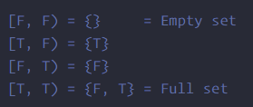
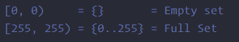

# **文件目录：**

```c
llvm/IR/ConstantRange.h		// 在usr/local/include/llvm/IR
llvm/lib/ConstantRange.cpp 	// 在下载的源码里BufferOverflow_RangeAnalysis/LLVM-10.0.0/llvm/lib/IR
```

```
ConstantRange r1；
r1范围为：
full-set、empty-set、[-∞,r1]、[r2，+∞]，[r1, r2], r1为正数、负数，r2为正数、负数

llvm::CmpInst::Predicate pred；
pred范围为：
ult，ule，ue，slt，sle，se，…,等等
```

# 重要定义

- important range

  

  其他整数范围使用最小/最大值的特殊范围值。例如，对于8位类型，它使用：

  

  

- 

# 待确认问题

1. R1的上界、下界，分别取什么值？

   

2. `ConstantRange`成员函数的使用

   - `ConstantRange:: makeAllowedICmpRegion(pred,r1)`返回的`ConstantRange`是什么样的

     ```c++
     // 生成最小的范围，以便所有满足给定谓词的值与Other中包含的任何值都包含在返回的范围中。
     // 形式上，这返回'Other中所有y的并集'的超集 
     // { x : icmp op x y is true }
     // 如果确切的答案不能用ConstantRange表示，则返回值将是上述内容的一个适当的超集。
     // 例如:Pred = ult and Other = i8[2,5)返回Result = [0,4)
     ConstantRange ConstantRange::makeAllowedICmpRegion(CmpInst::Predicate Pred, const ConstantRange &CR) {
     	if (CR.isEmptySet())
       		return CR;
     
       	uint32_t W = CR.getBitWidth();
       	switch (Pred) {
       	default:
         llvm_unreachable("Invalid ICmp predicate to makeAllowedICmpRegion()");
       	case CmpInst::ICMP_EQ:	// 相等
         	return CR;
       	case CmpInst::ICMP_NE:	//
         	if (CR.isSingleElement())
           		return ConstantRange(CR.getUpper(), CR.getLower());
         	return getFull(W);
       	case CmpInst::ICMP_ULT: {
         	APInt UMax(CR.getUnsignedMax());
         	if (UMax.isMinValue())
           		return getEmpty(W);
        	 	return ConstantRange(APInt::getMinValue(W), std::move(UMax));
       	}
       	case CmpInst::ICMP_SLT: {
         	APInt SMax(CR.getSignedMax());
         	if (SMax.isMinSignedValue())
           		return getEmpty(W);
         	return ConstantRange(APInt::getSignedMinValue(W), std::move(SMax));
       	}
       	case CmpInst::ICMP_ULE:
         	return getNonEmpty(APInt::getMinValue(W), CR.getUnsignedMax() + 1);
       	case CmpInst::ICMP_SLE:
         	return getNonEmpty(APInt::getSignedMinValue(W), CR.getSignedMax() + 1);
       	case CmpInst::ICMP_UGT: {
         	APInt UMin(CR.getUnsignedMin());
         	if (UMin.isMaxValue())
           		return getEmpty(W);
         	return ConstantRange(std::move(UMin) + 1, APInt::getNullValue(W));
       	}
       	case CmpInst::ICMP_SGT: {
         	APInt SMin(CR.getSignedMin());
         	if (SMin.isMaxSignedValue())
           		return getEmpty(W);
         	return ConstantRange(std::move(SMin) + 1, APInt::getSignedMinValue(W));
       	}
       	case CmpInst::ICMP_UGE:
         	return getNonEmpty(CR.getUnsignedMin(), APInt::getNullValue(W));
       	case CmpInst::ICMP_SGE:
         	return getNonEmpty(CR.getSignedMin(), APInt::getSignedMinValue(W));
       }
     }
     ```

     ```c++
     ConstantRange r6 = r1.makeAllowedICmpRegion(CmpInst::ICMP_EQ, r4);      // 相等
     // 原值
     
     // -------------------------------------------------------------------------------------
     ConstantRange r7 = r1.makeAllowedICmpRegion(CmpInst::ICMP_NE, r4);      // 不相等
     
     const APInt *getSingleElement() const {
         if (Upper == Lower + 1)
             return &Lower;
         return nullptr;
     }
     // 如果为single元素，则交换lower和upper；否则直接按宽度拉满。
     
     // -------------------------------------------------------------------------------------
     ConstantRange r8 = r1.makeAllowedICmpRegion(CmpInst::ICMP_ULT, r4);		// 如果unorder或小于，则为真
     
     llvm::APInt llvm::ConstantRange::getUnsignedMax() const;
     // 返回ConstantRange中最大的无符号值。
     bool llvm::APInt::isMinValue() const;
     // 确定这是否是最小的无符号值。这将检查该APInt的值是否为APInt位宽的最小无符号值。
     static llvm::ConstantRange llvm::ConstantRange::getEmpty(uint32_t BitWidth);
     // 用给定的位宽创建空的常量范围。
     static llvm::APInt llvm::APInt::getMinValue(unsigned int numBits);
     // 获取特定位宽的最小APInt无符号值。
     constexpr llvm::APInt &&std::move<llvm::APInt &>(llvm::APInt &__t) noexcept;
     // 将值转换为右值（rvalue）。将参数转换为右值引用（rvalue-reference），以允许移动它（好像是减1）。
     
     
     // -------------------------------------------------------------------------------------
     ConstantRange r9 = r1.makeAllowedICmpRegion(CmpInst::ICMP_SLT, r4);		// 有符号小于
     llvm::APInt llvm::ConstantRange::getSignedMax() const;
     // 返回ConstantRange中包含的有符号值。
     bool llvm::APInt::isMinSignedValue() const;
     // 确定这是否是最小的带符号值。这将检查该APInt的值是否为APInt的位宽的最小带符号值。
     static llvm::APInt llvm::APInt::getSignedMinValue(unsigned int numBits);
     // 获取特定位宽的最小有符号APInt值。
     
     // -------------------------------------------------------------------------------------
     ConstantRange r10 = r1.makeAllowedICmpRegion(CmpInst::ICMP_ULE, r4);	// 无符号小于等于
     static llvm::ConstantRange llvm::ConstantRange::getNonEmpty(llvm::APInt Lower, llvm::APInt Upper);
     // 创建具有给定边界的非空常量范围。如果Lower和Upper相同，则返回全范围。
     ?
     // -------------------------------------------------------------------------------------
     ConstantRange r11 = r1.makeAllowedICmpRegion(CmpInst::ICMP_SLE, r4);	// 有符号小于等于
     ?
     // -------------------------------------------------------------------------------------
     ConstantRange r12 = r1.makeAllowedICmpRegion(CmpInst::ICMP_UGT, r4);	// 无符号大于
     llvm::APInt llvm::ConstantRange::getUnsignedMin() const;
     // 返回ConstantRange中最小的unsigned值。
     bool llvm::APInt::isMaxValue() const;
     // 确定这是否是最大的无符号值。这将检查该APInt的值是否为APInt的位宽的最大无符号值。
     static llvm::APInt llvm::APInt::getNullValue(unsigned int numBits);
     // 获取'0'值。返回指定位宽的APInt的'0'值。
     ?
     // -------------------------------------------------------------------------------------
     ConstantRange r13 = r1.makeAllowedICmpRegion(CmpInst::ICMP_SGT, r4);	// 有符号大于
     llvm::APInt llvm::ConstantRange::getSignedMin() const;
     // 返回ConstantRange中包含的最小带符号值。
     bool llvm::APInt::isMaxSignedValue() const;
     // 确定这是否是最大的有符号值。这将检查该APInt的值是否为APInt的位宽的最大带符号值。
     ?
     // -------------------------------------------------------------------------------------
     ConstantRange r14 = r1.makeAllowedICmpRegion(CmpInst::ICMP_UGE, r4);	// 无符号大于等于
     
     
     // -------------------------------------------------------------------------------------
     ConstantRange r15 = r1.makeAllowedICmpRegion(CmpInst::ICMP_SGE, r4);	// 有符号大于等于
     
     
     ```

     

   - `ConstantRange::makeSatisfyingICmpRegion(pred,r1)`返回的`ConstantRange`是什么样的

     ```c++
     // 生成最大范围，以便返回范围中的所有值满足给定谓词与Other中包含的所有值。
     // 形式上，它返回'Other中所有y的交集'的子集。
     // { x : icmp op x y is true }
     // 如果准确的答案不能用ConstantRange表示，则返回值将是上述内容的一个适当子集。
     // 例如:Pred = ult and Other = i8[2,5)返回[0,2)?
     ConstantRange ConstantRange::makeSatisfyingICmpRegion(CmpInst::Predicate Pred, const ConstantRange &CR) {
     	// Follows from De-Morgan's laws:
         //
         // ~(~A union ~B) == A intersect B.
         //
         return makeAllowedICmpRegion(CmpInst::getInversePredicate(Pred), CR)
             .inverse();
     }
     ```

     ```c++
     ConstantRange ConstantRange::inverse() const {
     	if (isFullSet())
         	return getEmpty();
      	if (isEmptySet())
         	return getFull();
       	return ConstantRange(Upper, Lower);
     }
     ```

     

   - `ConstantRange:: makeExactICmpRegion(pred,r1)`返回的`ConstantRange`是什么样的

     ```c++
     // 生成精确的范围，以便返回范围中的所有值都用Other中包含的任何值满足给定谓词。
     // 形式上，当'Other上所有y的并集'的超集与'Other中所有y的交集'的子集完全相同时，返回确切的答案。 
     // { x : icmp op x y is true}
     // 例如:Pred = ult and Other = i8 3返回[0,3]
     ConstantRange ConstantRange::makeExactICmpRegion(CmpInst::Predicate Pred, const APInt &C) {
     	// 计算与makeAllowedICmpRegion和makeSatisfyingICmpRegion返回的常量范围相等的精确范围。
         // 当RHS是一个单例对象(如APInt)时，这总是正确的，因此断言是有效的。
         // 然而，对于非单例RHS，例如ult [2,5) makeallowedicmpreregion返回[0,4)，但makesatisfyicmpreregion返回[0,2)。
       	assert(makeAllowedICmpRegion(Pred, C) == makeSatisfyingICmpRegion(Pred, C));
       	return makeAllowedICmpRegion(Pred, C);
     }
     ```

     

   - `ConstantRange`构造函数，在构造`full`、`empty`的`Range`时，会设置什么样的上界、下界

     ```c++
     // 为指定的位宽初始化一个完整或空集。 
     ConstantRange::ConstantRange(uint32_t BitWidth, bool Full)
          : Lower(Full ? APInt::getMaxValue(BitWidth) : APInt::getMinValue(BitWidth)),
            Upper(Lower) {}
     // 当ifFullSet为true时，BitWidth由第一个参数设置，Lower的value为该宽度下的最大整数值，Upper由Lower拷贝构造
     (llvm::ConstantRange) $0 = {
       Lower = {
         U = {
           VAL = 65535
           pVal = 0x000000000000ffff
         }
         BitWidth = 16
       }
       Upper = {
         U = {
           VAL = 65535
           pVal = 0x000000000000ffff
         }
         BitWidth = 16
       }
     }
     // 当ifFullSet为false时，BitWidth由第一个参数设置，Lower的value为该宽度下的最小整数值（为0？），Upper由Lower拷贝构造
     (llvm::ConstantRange) $0 = {
       Lower = {
         U = {
           VAL = 0
           pVal = 0x0000000000000000
         }
         BitWidth = 16
       }
       Upper = {
         U = {
           VAL = 0
           pVal = 0x0000000000000000
         }
         BitWidth = 16
       }
     }
     
     ```

     ```c++
      // 初始化范围以保存单个指定值。
      ConstantRange::ConstantRange(APInt V)
          : Lower(std::move(V)), Upper(Lower + 1) {}
     
     // APInt未进行初始化的话，值为1，位宽为1
     (llvm::APInt) $0 = {
       U = {
         VAL = 1000
         pVal = 0x00000000000003e8
       }
       BitWidth = 16
     }
     
     (llvm::ConstantRange) $1 = {
       Lower = {
         U = {
           VAL = 1000
           pVal = 0x00000000000003e8
         }
         BitWidth = 16
       }
       Upper = {
         U = {
           VAL = 1001
           pVal = 0x00000000000003e9
         }
         BitWidth = 16
       }
     }
     ```

     ```c++
      // 显式初始化一个值范围。 这将assert if Lower==Upper 和 Lower != 其类型的最小或最大值。
      // 如果两个APInt的位宽不相同，则输出assert。
      ConstantRange::ConstantRange(APInt L, APInt U)
          : Lower(std::move(L)), Upper(std::move(U)) {
        assert(Lower.getBitWidth() == Upper.getBitWidth() &&
               "ConstantRange with unequal bit widths");
        assert((Lower != Upper || (Lower.isMaxValue() || Lower.isMinValue())) &&
               "Lower == Upper, but they aren't min or max value!");
      }
     
     (llvm::APInt) $0 = {
       U = {
         VAL = 1024
         pVal = 0x0000000000000400
       }
       BitWidth = 16
     }
     
     (lldb) p upper
     (llvm::APInt) $1 = {
       U = {
         VAL = 4096
         pVal = 0x0000000000001000
       }
       BitWidth = 16
     }
     
     (llvm::ConstantRange) $2 = {
       Lower = {
         U = {
           VAL = 1024
           pVal = 0x0000000000000400
         }
         BitWidth = 16
       }
       Upper = {
         U = {
           VAL = 4096
           pVal = 0x0000000000001000
         }
         BitWidth = 16
       }
     }
     ```

     ```c++
     // 正常情况下储存unsigned值
     // 整数位宽 <= 64，使用VAL，否则使用pVal。
     // pVal为地址
     APInt(unsigned numBits, uint64_t val, bool isSigned = false)
         : BitWidth(numBits) {
             if (isSingleWord()) {
                 U.VAL = val;
                 clearUnusedBits();
             } else {
                 initSlowCase(val, isSigned);
             }
         }
     // 如果 isSigned 为真，则 val 被视为一个有符号值（即作为 int64_t），并且将完成位宽的适当符号扩展。否则，不会发生符号扩展（超出 val 范围的高位用零填充）。
     
     APInt value2((unsigned)16, -1000, true);
     (llvm::APInt) $0 = {
       U = {
         VAL = 64536
         pVal = 0x000000000000fc18
       }
       BitWidth = 16
     }
     10000000000000000
     ```

     

   - 其他方法，如：`makeGuaranteedNoWrapRegion`，`makeExactNoWrapRegion`，`getUnsignedMax`，`getUnsignedMin`，`getSignedMax`，`getSignedMin`，`intersectWith`，`unionWith`的功能

     ```c++
     static llvm::ConstantRange llvm::ConstantRange::makeGuaranteedNoWrapRegion(llvm::Instruction::BinaryOps BinOp, const llvm::ConstantRange &Other, unsigned int NoWrapKind);
     // 返回包含所有X的最大范围，以确保“X BinOpC Y”在Other中不会对所有Y换行(溢出)。
     // 返回的集合不包含“X BinOpC Y”没有包装的X的**所有**可能的值——X的一些可行值可能会丢失，所以你不能使用它来约束X的范围。例如，在第四个例子中，“(-2)+ 1”既是nsw又是nuw(所以“X”可以是-2)，但是(-2)不在返回的集合中。
     
     例子:
     typedef OverflowingBinaryOperator鄂博;
     #定义MGNR makeGuaranteedNoWrapRegion
     MGNR(Add， [i8 1, 2)， OBO::NoSignedWrap) ==[- 128,127); / /删除
     MGNR(Add， [i8 1,2)， OBO::NoUnsignedWrap) == [0， -1)
     MGNR(Add， [i8 0,1)， OBO::NoUnsignedWrap) ==全集
     MGNR(添加，[i8 1,2)， OBO::NoUnsignedWrap | OBO::NoSignedWrap)
     = = [0, INT_MAX)
     MGNR(Add， [i8 - 1,6)， OBO::NoSignedWrap) == [INT_MIN+1, INT_MAX-4]
     MGNR(Sub， [i8 1,2)， OBO::NoSignedWrap) == [- 127,128)
     MGNR(Sub， [i8 1,2)， OBO::NoUnsignedWrap) == [1,0)
     MGNR(Sub， [i8 1,2)， OBO::NoUnsignedWrap | OBO::NoSignedWrap) MGNR(Sub， [i8 1,2)， OBO::NoSignedWrap)
     = = [1, INT_MAX)
     ```

     ```c++
     static llvm::ConstantRange llvm::ConstantRange::makeExactNoWrapRegion(llvm::Instruction::BinaryOps BinOp, const llvm::APInt &Other, unsigned int NoWrapKind);
     // 当且仅当“X BinOp Other”没有换行时，生成包含X的范围。
     
     ```

     ```c++
     llvm::APInt llvm::ConstantRange::getUnsignedMax() const;
     // 返回ConstantRange中最大的无符号值。
     
     llvm::APInt llvm::ConstantRange::getUnsignedMin() const;
     // 返回ConstantRange中最小的unsigned值。
     
     llvm::APInt llvm::ConstantRange::getSignedMax() const;
     // 返回ConstantRange中包含的有符号值。
     
     llvm::APInt llvm::ConstantRange::getSignedMin() const;
     // 返回ConstantRange中包含的最小带符号值。
     
     ```

     ```c++
     llvm::ConstantRange llvm::ConstantRange::intersectWith(const llvm::ConstantRange &CR, llvm::ConstantRange::PreferredRangeType Type = llvm::ConstantRange::Smallest) const;
     // 返回此范围与另一个范围的交集所产生的范围。 如果交集是不相交的，因此可能有两个结果，则首选范围由PreferredRangeType决定。  ?
     ```

     ```c++
     llvm::ConstantRange llvm::ConstantRange::unionWith(const llvm::ConstantRange &CR, llvm::ConstantRange::PreferredRangeType Type) const;
     // 返回这个范围与另一个范围的并集所产生的范围。 结果范围保证包含这两个集合的元素，但也可能包含更多。 
     // 例如，[3,9)并集[12,15)是[3,15)，其中包括9、10和11，它们以前没有包含在任何一个集合中。  ?
     ```

     

   - 

3. 

# 运行实例

## test01

```c
#include <stdio.h>
#include <stdlib.h>

int a = 0;
int b[2] = {1, 2};

int foo()
{
    b[2] = 5;
    return 0;
}


int i = 0;
int main()
{
    b[1] = 0;
    foo();
    for(; i < 3; i++)
        b[i] = i;
    return 0;
}
```


```
----------------------
PA (Using pointer analysis to reslove indirect calls) 
#Total Callsites: 1
#Total Indirect Callsites: 0
#Resolved Indirect Callsites: 0
#Total Number of ICS targets: 0
main.arrayidx full-set
main.retval [0,1)
ret.foo [0,1)
ret.main [0,1)
var.a [0,1)
var.i full-set
#############################################
              Array Bound Checks Pass          
#############################################
[GEP instruction detected] Line: 9
  i32* getelementptr inbounds ([2 x i32], [2 x i32]* @b, i64 1, i64 0)
    index 0...
        Index (Constant): 1
    index 1...
        Index (Constant): 0
    ****************************************
      Array Access Violation detected!
      Array index: 2 >= Array size: 2
    ***************************************

[GEP instruction detected] Line: 17
  i32* getelementptr inbounds ([2 x i32], [2 x i32]* @b, i64 0, i64 1)
    index 0...
        Index (Constant): 0
    index 1...
        Index (Constant): 1
    No Violation. Array size: 2, Access index: 1

[GEP instruction detected] Line: 20
    %arrayidx = getelementptr inbounds [2 x i32], [2 x i32]* @b, i64 0, i64 %idxprom, !dbg !33
    index 0...
        Index (Constant): 0
    index 1...
        KintID:var.i
    ****************************************
      Array Access Violation detected!
      Array index: full-set >= Array size: 2
    ***************************************

#############################################
              Libc Bound Checks Pass          
#############################################
```

