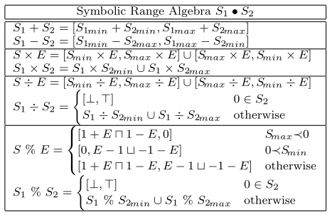
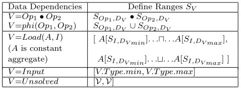
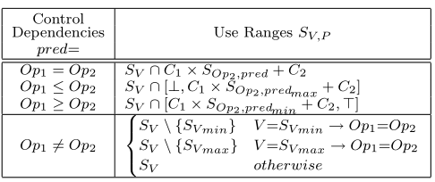
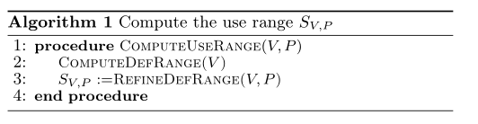

# Practical and Effective Symbolic Analysis for Buffer Overflow Detection

## 名词解释

- MLOC: Million Lines of Code
- Scalability: 可伸缩性(可扩展性)是一种对软件系统计算处理能力的设计指标，高可伸缩性代表一种弹性，在系统扩展成长过程中，软件能够保证旺盛的生命力，通过很少的改动甚至只是硬件设备的添置，就能实现整个系统处理能力的线性增长，实现高吞吐量和低延迟高性能。
- LLVM: low level virtual machine
- 符号分析：
- 控制依赖项：
- phi：

## 摘要

### 背景

现有的**符号分析**技术要么太复杂，难以扩展到**百万行级别**的代码；要么过于简单，难以处理**循环和复杂**的程序结构。

### 类别和主题描述符

D.2.5[软件工程]：测试和调试——符号执行 

### 新算法

- 解决相关的控制和数据依赖问题
- 路径敏感：可以有效处理循环和复杂程序结构
- 可伸缩性：通过使用简单的符号值表示、过滤掉符号值计算中不相关的依赖项以及按需计算符号值来实现。 

## 引言

- demand-driven symbolic analysis algorithm 
- 

## 相关工作

符号分析在20世纪70年代引入[16]，最近已应用于许多方法中，以检测缓冲区溢出[29、14、24、10、32、15、17、2、22、5]。在符号分析中，程序以符号值作为输入执行。在符号执行期间，通过操纵包含符号值的程序表达式（即，以符号方式解决数据依赖关系），将程序变量的值计算为符号表达式。诸如分支指令之类的控制语句是通过（概念上）遵循两个分支并维护每个分支上的控制谓词信息（即控制依赖项）来执行的。

现有的符号分析技术在符号值的不同表示形式以及符号值的计算方式上各不相同。在[29,14]中，符号值被简化为**整数范围**，作者将范围分析问题**映射为整数线性规划（ILP）**问题，即指数问题。Rugina和Rinard[24]通过使用不同的符号表示将ILP问题简化为线性规划问题：变量的符号值被抽象为输入变量集的线性函数，然后使用线性约束求解器来求解每个变量的线性表示。然而，对于具有数百万LOC的大型应用程序，线性约束解算器一起求解所有程序变量的表示将非常耗时。这些方法对路径不敏感，因为在不同执行路径合并的指令中，要么根本不使用控制依赖项，要么丢弃控制依赖项，从而导致报告的缓冲区溢出不精确（即高误报率）。

Xie等人[32]使用**单个符号的线性导数**来表示符号值，然后通过解释程序来计算符号值。在他们的方法中，符号值之间的计算是不受支持的，具有非恒定迭代的循环是通过简单地展开它们一次并在假设循环测试失败的情况下终止它们来处理的。尽管在各种方法中采用了这种处理循环的简化方法[13,31,2]，但它可能会遗漏许多错误，并可能导致一些误报。在[10]中，作者将符号分析形式化为**抽象解释**的特例[9]。他们定义了一组抽象域来表示不同精度级别的符号值，用户可以选择使用哪个抽象域。抽象域越精确，分析成本就越高。如本文所述，他们的方法可以扩展到数万个LOC。这项工作中描述的技术可以作为一个不同的抽象域集成到他们的框架中。

与上述方法相比，单元测试[1,22,5]中应用的符号分析通常更精确，方法是彻底遍历所有可能的执行路径，并使用外部约束解算器或定理证明器来解决每条路径上的所有数据和控制依赖关系，其中，控制依赖项通常表示为每条路径上的额外约束。**假设在存在循环的情况下，可能的执行路径的数量是无界的，并且执行路径可能非常长，通常会引入限制来限制遍历循环的迭代次数和每个执行路径上的约束数量**。

[17]中的作者通过**需求驱动**改进了上述方法的可伸缩性：它们不是象征性地执行程序，而是从每个缓冲区访问指令向后遍历所有可能的执行路径。在反向遍历期间，额外的数据依赖项和控制依赖项由外部约束解算器增量分析，允许分析数十万个LOC。与[1,22,5]一样，应用循环边界和路径限制。

在本文中，我们在计算程序变量的符号值时，通过**迭代**求解相关的数据依赖项和控制依赖项，对**精度**和**可伸缩性**进行了不同的权衡。而不是穷尽遍历所有执行路径，我们只考虑**线性相关的控制依赖关系**，可以有效地解决。由于数组索引变量的值通常只依赖于数据和线性相关的控制依赖项，因此它在查找缓冲区溢出时非常有效。因此，正如我们的实验结果所示，我们的方法是可扩展和有效的，可以很好地扩展到数百万LOC。 

## 激励性的例子 

关键是确定需要考虑哪些依赖关系，以及如何根据这些依赖关系计算程序变量的值。 

## 符号分析 

### 符号值表示 

一个简单的符号表示域 

符号范围

### 计算符号范围

#### 数据约束

#### 控制依赖项 

### 增强

#### 循环归纳变量分析 

循环归纳变量是指其值在循环的连续迭代中呈现**简单级数**的变量。循环归纳变量分析[3]试图将这些变量表示为循环迭代次数的函数，因此在计算归纳变量和循环迭代次数的符号范围时，可以考虑它们之间的依赖关系。此分析对于缓冲区溢出检测非常重要，因为归纳变量通常以循环索引和下标计算的形式出现。在我们的分析中，我们只考虑作为循环迭代数仿射函数的归纳变量。 

#### 路径敏感分析 

到目前为止的分析是谓词感知的，但它不是完全路径敏感的。我们考虑了变量用途的控制依赖性，但没有考虑其**定义的控制依赖性**。在phi指令中，当沿不同路径定义的值合并时，路径敏感分析将检查定义将从哪些路径到达phi指令。然后，还可以考虑沿其传入定义路径的控件依赖性，从而更精确地计算phi指令的定义和使用范围。我们根据需要计算门控单分配（GSA）[21]形式，用于路径敏感分析。在GSA形式中，phi指令V=phi（v1，v2）被扩展为称为γ树的二叉决策树。传入的定义v1和v2是γ树中的叶节点，谓词节点是树中的内部节点，用于指导选择哪个定义。在计算phi指令的符号范围时，我们递归遍历γ树，并根据phi指令的控制依赖关系以及γ树中的控制谓词计算其传入操作数的使用范围。通过只按需计算相关phi指令的GSA表单，运行时开销最小化。 

## 需求驱动算法 

好像就是计算结构体成员memory size时的方法，只在其使用的时候进行计算。

### 迭代求解数据依赖关系 
